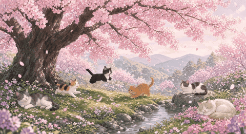

# 🌸🐱 こんにちは、TOSHIです 🐱🌸

 

 
 

**思いついたら、数時間後にはもう動いてる。**  
コードも、日常も、ちょっと可愛くしたいエンジニアです。

---

## 🌸 About me

やあ、TOSHIです。

職人でもアーキテクト純血でもなく、**ジェネラリスト・ソロボルダー**。  
プロダクト、インフラ、AI、社内ツール、動画、自作キーボードまで、領域はあまり選びません。

- 🐱 ソフトウェアエンジニア（採用・店舗まわりのプロダクトが本業）
- 🌸 AIと一緒に、とりあえず動くものを先に出すのが好き
- 🐱 Slack から話しかけるだけで仕事が進む道具をよく作る
- 🌸 自作キーボード（ZMK / roBa / 双掌）が趣味
- 🐱 飲食店のリサーチも、つい本気でやっちゃう
- 🌸 「人が喜ぶ」が燃料。夜ふかししてコードを書くタイプ

> 対応しました！　作成しました！　とりあえず動くもの作ったんで見てください

  

---

## 🐱 Tech I use

実際に手を動かしてるものを中心に。

### 🌸 Languages

  
  
  
  
  
  

### 🐱 Frontend

  
  
  
  

### 🌸 Backend / Data

  
  
  
  
  

### 🐱 Cloud / Infra

  
  
  
  
  

### 🌸 AI / Automation

  
  
  
  
  

### 🐱 Hobby

  
  

よく触る組み合わせのイメージ:

| 🌸 領域 | 🐱 よく使うもの |
| --- | --- |
| プロダクト開発 | TypeScript / React / Go / MySQL / TypeSpec |
| インフラ | AWS CDK / Lambda / ECS / Docker |
| 社内ツール・自動化 | Slack / Claude / Cursor / Playwright |
| 趣味 | Swift / ZMK / 自作キーボード |

  

---

## 🌸 GitHub

  <picture>
    <source media="(prefers-color-scheme: dark)" srcset="./dist/pet.svg" />
    <source media="(prefers-color-scheme: light)" srcset="./dist/pet-light.svg" />
    
  </picture>
   
   
  
   
  
   
   
  

---

### 🌸🐱 来てくれてありがとう 🐱🌸

*また桜のころ、遊びにきてね*

